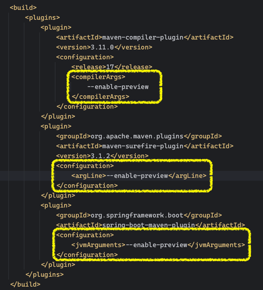
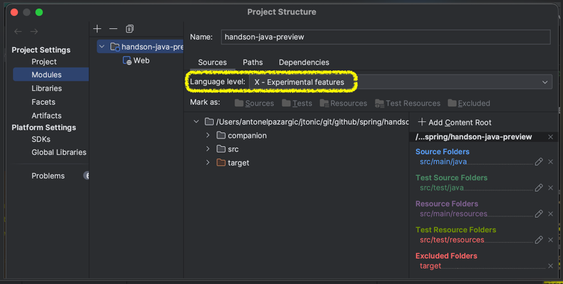
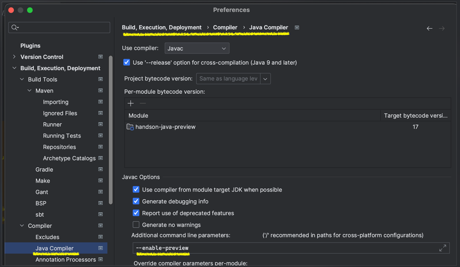
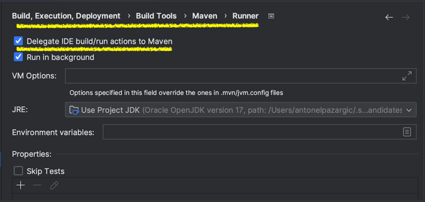

### Configure java 17 for `--enable-preview` mode 

- in pom.xml

- Idea project configuration

### build the application

   > mvn clean install

### run the application

1. 
   > mvn clean test-compile spring-boot:run

2. 
   > java --enable-preview -jar ./target/handson-java-preview-0.0.1-SNAPSHOT.jar 
    
3. Use shared run configuration from IJ Idea 

