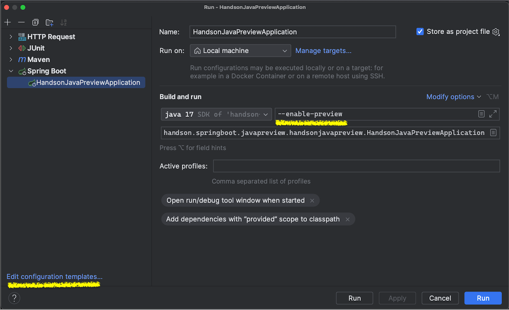

### Configure java 17 for `--enable-preview` mode 

- in pom.xml

- Idea project configuration

Caution:
* unfortunately after each modification of the `pom.xml` or after the project re-import this change is lost, and
* IJ offers PREVIEW functionality only for the latest two java versions (and even this might not hold), which definitely doesn't include (27 Sept 2023) preview for java 17

### make sure java 17 is installed and default on the system (sdkman)

* check the current java version 
   > sdk current java
* if java 17 is not installed, then run 
  > java 17.0.8-oracle
* make sure you use the installed version in the terminal
  > sdk use java 17.0.8-oracle
* check the java version 
  > java --version

### build the application
   > mvn clean install

### run the application

* > mvn clean test-compile spring-boot:run

   or
* > java --enable-preview -jar ./target/handson-java-preview-0.0.1-SNAPSHOT.jar 
   
   or 
* Use shared run configuration from IJ Idea 
  
  Notes:
  * If you don't want to bother having this special argument settings for each new created IJ Run Configuration, then change their templates. See below how.

    

## Java 17 preview features

- Pattern match in switch expression

  This is just a sneak peak into what java 21 pattern match is capable of
